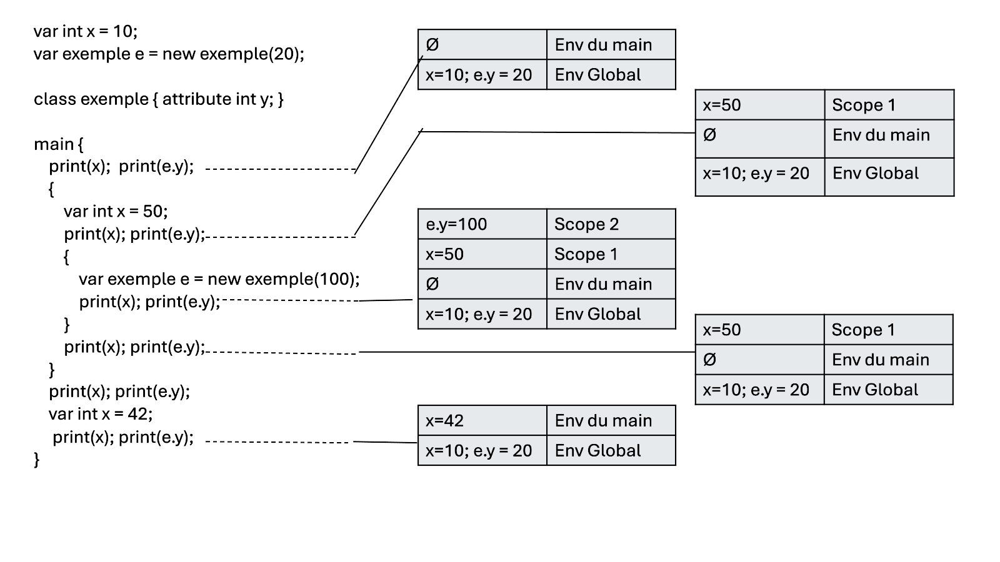

```sh
# build and execute
dune build && dune exec ./kawai.exe -- <args>
dune build && ./kawai.exe <args>
# run
./kawai.exe <file1> [--help | --show-source | -s]
# exemples  :
./kawai.exe ./tests/var.kwa
dune build && ./kawai.exe -s
```


**Auteurs:**
- Arthur SAILLANT (LDD3IM)
- Rayan LALAOUI (LDD3IM)

[lien du repo github](https://github.com/TortueSandwich/NotJava-kawa)

## Sommaire

- [Rapport de Projet](#rapport-de-projet)
  - [Sommaire](#sommaire)
  - [Répartition du Travail](#répartition-du-travail)
  - [Difficultés](#difficultés)
  - [Tests](#tests)
  - [Fonctionnalités](#fonctionnalités)
  - [Fonctionnalités supplémentaires](#fonctionnalités-supplémentaires)
  - [Proposition d'amélioration](#proposition-damélioration)
  - [Commentaires personnels](#commentaires-personnels)
    - [Arthur SAILLANT](#arthur-saillant)
    - [Rayan LALAOUI](#rayan-lalaoui)

## Rapport de Projet

### Répartition du Travail<a name="répartition-du-travail"></a>

Nous avons abordé le projet de manière incrémentale, en établissant un ordre de mise en œuvre des fonctionnalités basé sur leur complexité et la simplicité des tests associés. Après avoir mis en place un framework permettant de choisir et de gérer les tests de manière efficace, notre objectif initial était d'afficher les tokens (en couleur !) afin de faciliter le débogage. Une fois cette étape terminée, nous avons poursuivi avec la phase de parsing, puis nous avons implémenté l'interpréteur capable de traiter tous les tests fournis dans le cadre du projet. Ce n'est qu'ensuite que nous avons développé le typechecker.

Au début, la répartition des tâches s'est faite de manière assez fluide : Arthur s'est principalement chargé de l'affichage des tokens, du parsing et de l'interpréteur, tandis que Rayan a pris en charge l'implémentation du typechecker, assurant ainsi la vérification des types pour tous les tests de base.

Ensuite, les fonctionnalités supplémentaires ont été implémentées individuellement, chaque membre prenant en charge l'ajout de fonctionnalités spécifiques de son côté. Cela a impliqué des modifications dans plusieurs fichiers du projet, ce qui a occasionné quelques difficultés lors des merges Git. Bien que ces conflits aient parfois causé des confusions, ils ont été résolus grâce au sang-froid de Rayan, qui a su gérer la situation avec calme et efficacité.

---

### Difficultés<a name="difficultés"></a>

Nous avons rencontré plusieurs difficultés au cours du projet, notamment en ce qui concerne l'utilisation de Git et la gestion des conflits. Mais, la difficulté majeure a été le parsing, surtout en ce qui concerne les fonctionnalités supplémentaires, qui introduisaient des aspects de syntaxe assez complexes.

Pour rendre notre langage compatible avec une analyse LR(1), nous avons dû modifier certaines parties de la syntaxe "habituelle" (inspirée de Java). Par exemple, pour le typecast, nous avons choisi une syntaxe inspirée de Rust, passant de la forme `(type) expr` à `expr as type`. Cette modification a permis une meilleure intégration avec le parseur, mais a ajouté de la complexité à la syntaxe.

Un autre défi est survenu avec la gestion des types génériques. Nous avons décidé d'introduire le mot-clé `generic` pour que Menhir puisse choisir plus facilement la règle appropriée, ce qui rend la syntaxe malheureusement verbeuse.

Enfin, l'ajout de messages d'erreur détaillés a constitué un casse-tête. Menhir ne dispose pas d'une documentation très complète, ce qui a rendu difficile la compréhension de son fonctionnement interne. Cela a rendu l'implémentation des messages d'erreur plus complexe que prévu.

---

### Tests<a name="tests"></a>

Nous avons ajouté un test pour chaque fonctionnalité implémentée, y compris des tests conçus pour échouer. Ils ont permis de vérifier le bon fonctionnement de la syntaxe et du type checker en simulant des erreurs intentionnelles. Ces tests ont validé la capacité du compilateur à réagir correctement aux erreurs et de s'assurer que les messages d'erreur étaient appropriés et clairs.

---

### Fonctionnalités<a name="fonctionnalités"></a>

- [x] Les fonctionnalités de base
- [x] Champs immuables ([final.kwa](./tests/final.kwa))
- [x] Visibilités ([encapsulation.kwa](./tests/encapsulation.kwa))
- [x] Déclarations en série ([multivar.kwa](./tests/multivar.kwa))
- [x] Déclaration avec valeur initiale ([multivarinit.kwa](./tests/multivarinit.kwa))
- [ ] Champs statiques
- [x] Test de type (`instance of`) ([instanceof.kwa](./tests/instanceof.kwa))
- [x] Transtypage (cast) ([rayan.kwa](./tests/rayan.kwa))
- [x] Super ([super.kwa](./tests/super.kwa))
- [x] Tableaux ([tab.kwa](./tests/tab.kwa) et [objtab.kwa
](./tests/objtab.kwa))
- [x] Égalité structurelle (`===` & `=/=`) ([structeq.kwa](./tests/structeq.kwa))
- [ ] Classes et méthodes abstraites (on a des interfaces à default)
- [ ] Surcharge statique
---
- [ ] Déclarations simplifiées (enlever var, method)
- [x] "Missing semicolon" ([missingsemi.kwa](./tests/missingsemi.kwa))
- [x] "Did you mean '...'?" ([didyou.kwa](./tests/didyou.kwa) je recommande ce test)
- [x] Le processus ne peut pas aboutir en raison d'un problème technique
- [x] Syntaxe abstraite typée (`annot` et `expr_`)

---

### Fonctionnalités supplémentaires<a name="fonctionnalités-supplémentaires"></a>

- déclaration et initialisation de variable en tant qu'instruction ([multivarinit.kwa](./tests/multivarinit.kwa))
- Portée & shadowing ([shadowing.kwa](./tests/shadowing.kwa))
- Classes génériques ([generictype.kwa](./tests/generictype.kwa))
- Interfaces (avec ou sans implémentation par défaut) ([interface_simple.kwa](./tests/interface_simple.kwa) & [interface_default.kwa](./tests/interface_default.kwa))
- des messages d'erreurs plus explicite ([voir l'handleling des erreurs](kawai.ml#L189))

---

### Proposition d'amélioration<a name="proposition-damélioration"></a>

- Implémenter les references et l'ownership
- Permettre d'avoir des constantes génériques au sein d'une classe
- "Sous-typage" des interfaces (passer une classe implémentant une interface en paramètre)

---

### Détails d'implémentation


#### Messages d'erreur

Nous avons fait le choix de maintenir un code propre, flexible et facilement extensible. Toutefois, cela s'est avéré complexe, surtout à mesure que le code grossissait, ce qui a parfois ralenti notre productivité. Nous avons pris soin de gérer les erreurs de manière propre et structurée, c'est pourquoi le [gestionnaire d'erreurs](kawai.ml#L189) occupe une place importante dans le fichier [kawai.ml](kawai.ml#L189). 

Les messages d'erreur sont personnalisés, en particulier avec l'indication précise de la position où l'erreur se produit, ce qui facilite grandement le débogage. Dans l'[interpréteur](./interpreter.ml#L14), le nombre d'erreurs est limité, car la majorité des erreurs sont détectées en amont par le [vérificateur de types](./typechecker.ml#L5).

<!-- TODO montrer des exemple à la fin ? -->

---

#### stackenv
Nous avons implémenté la gestion des portées et du *shadowing* à l'aide d'une structure de données personnalisée appelée `stack_env` ([source](./stack_env.ml)). Il s'agit d'une pile de tables de hachage, mais avec un "fond" commun (le dernier élément) partagé entre chaque instance de `stack_env`. Ce fond représente la portée globale du programme, c'est-à-dire les données accessibles à l'échelle mondiale. Chaque élément de la pile représente ensuite une portée imbriquée.

Pour résoudre une requête, il suffit de parcourir la pile de haut en bas, en cherchant la première occurrence de la donnée dans chaque table de hachage. À la fin d'une portée, le premier élément est retiré de la pile, permettant ainsi de revenir à l'environnement de portée précédent.

Le fond doit être commun à chaque instance de `stack_env` afin que les données globales restent accessibles, même dans des contextes totalement différents du programme principal, comme au sein des classes et méthodes.



---

### Commentaires personnels<a name="commentaires-personnels"></a>

#### Arthur SAILLANT
<!-- TODO -->

#### Rayan LALAOUI


